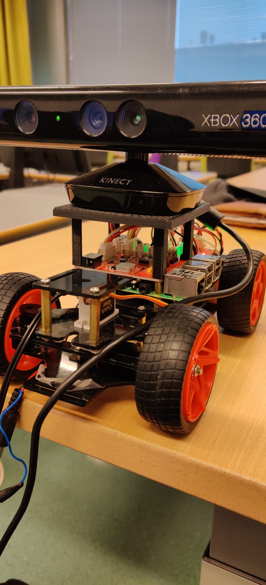

# Visual SLAM on mobile robot

The aim of this project was to use principles of Visual SLAM on self-built robot with low budget.

## Hardware

Chassis: SunFounder PiCar-V  
Camera: Xbox Kinect  
  


## Instructions for usage

Below the instructions for usage are given with configurable parameters  
  
### src/navigation_stack/launch/start_navigation.launch  
&nbsp;&nbsp;-> Starts Kinect driver: openni_launch (http://wiki.ros.org/openni_launch)  
&nbsp;&nbsp;-> Starts RTABMap: custom_rtabmap/launch/start_mapping.launch (http://wiki.ros.org/rtabmap_ros)  
  
  
#### Parameters
<i>depth_to_laser</i> = <b>false</b> > start point_cloud_converter to convert PointCloud to LaserScan  
debugging = true > > > > start RQT_GUI to debug the project  
rviz = false > > > > > > start rviz for visualize 
rtabmapviz = false > > > start rtabmapviz for visualization  
localization = false > > start the custom_rtabmap in localization mode  
mode = 5 > > > > > > > > mode for openni_driver resolution >> WORKING (5=QVGA 30Hz, 2=VGA 30Hz)  
  
  
Modification of RTABMap parameters done in src/custom_rtabmap/config/slam.yaml:  
&nbsp;&nbsp;-- full list of modifiable parameters can be found for e.g. Grid with  
&nbsp;&nbsp;``` rosrun rtabmap_ros rtabmap --params | grep Grid ```  
  
  
### src/move_base_launch/launch/move_base_final.launch
&nbsp;&nbsp;-> Starts move_base node responsible for path planning (http://wiki.ros.org/move_base)  
 
#### Costmap configurations
/costmaps/base_local_planner.yaml
/costmaps/global_costmap_params.yaml
/costmaps/local_costmap_params.yaml
/costmaps/costmap_common_params.yaml
  
  
### src/car_control

Package for controlling PiCar-V. Includes commands parsing and transformation to used by PiCar motor drivers.  
This node is running on Raspberry Pi which controls the actual car.


### src/static_transform_mux (https://github.com/tradr-project/static_transform_mux)

NECESSARY FOR RECORDING ROSBAG WITH OPENNI_LAUNCH:  
&nbsp;&nbsp;Used for recording multiple static_transform_publisher messages when recording ROSBAG with openni_launch.  
&nbsp;&nbsp;Otherwise the all transformations can't be reliably recorded simultaneously


### src/image_pipeline/camera_calibration

Package for Kinect calibration. See more instructions at http://wiki.ros.org/image_pipeline
  
  
### src/tf_launch

Package for creating custom transformations links with zero displacement. Used for debugging.  
/launch/launch_tf.launch asks for amount of transformations and the start and end points of the transformation.  
  
  
## Authors

The ownership of previously described packages belong to the original authors.  
The full project was done in co-operation  
* **Teemu Sormunen** -- **Pekka Leppänen**


## Acknowledgments

* Thanks for author of RTABMap M. Labbé, who has made huge contribution for SLAM community   
&nbsp;&nbsp;in form of helpful tutorials of implementing RTABMap. 
